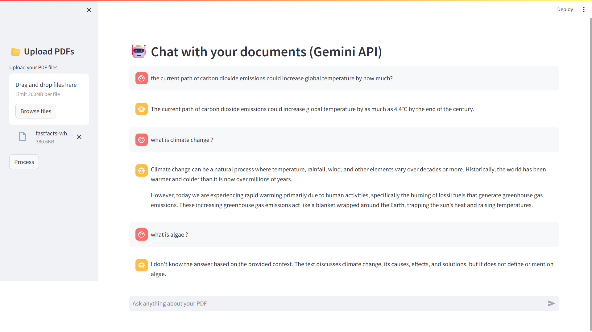

# 🤖 AI PDF Chatbot (Gemini + RAG)

An intelligent PDF chatbot built using **Google Gemini, LangChain, FAISS, and Streamlit** that allows users to upload PDFs and ask questions in natural language. The chatbot retrieves relevant information from documents and provides accurate, context-aware answers.

---

## 🚀 Features

* 📂 Upload and chat with multiple PDF documents
* 🔎 Semantic search using FAISS vector database
* 🧠 Retrieval Augmented Generation (RAG) architecture
* 🤖 Google Gemini LLM for accurate responses
* 💬 Conversational memory for context-aware answers
* ⚡ Fast and interactive Streamlit UI
* 📄 Source chunk display for transparency
* 🔐 Secure API key management using `.env`

---

## 📸 Application Preview

Below is the user interface of the AI PDF Chatbot:



## 🛠️ Tech Stack

* **LLM:** Google Gemini
* **Framework:** LangChain
* **Embeddings:** Sentence Transformers (HuggingFace)
* **Vector DB:** FAISS
* **Frontend:** Streamlit
* **PDF Processing:** PyPDF2
* **Environment:** Python

---

## 📂 Project Structure

```
Information-Retrieval-system/
│
├── app.py                 # Streamlit application
├── requirements.txt       # Dependencies
├── .env                   # API keys (not pushed to GitHub)
│
└── src/
    └── helper.py          # Core RAG pipeline
```

---

## ⚙️ Installation

### 1️⃣ Clone the repository

```bash
git clone https://github.com/your-username/Information-Retrieval-system.git
cd Information-Retrieval-system
```

---

### 2️⃣ Create a virtual environment

```bash
python -m venv venv
```

Activate environment:

**Windows**

```bash
venv\Scripts\activate
```

**Mac/Linux**

```bash
source venv/bin/activate
```

---

### 3️⃣ Install dependencies

```bash
pip install -r requirements.txt
```

---

### 4️⃣ Set up environment variables

Create a `.env` file in the root directory:

```
GOOGLE_API_KEY=your_gemini_api_key_here
```

Get your API key from Google AI Studio.

---

### 5️⃣ Run the application

```bash
streamlit run app.py
```

---

## 📸 How It Works

1. Upload one or more PDF files
2. The system extracts and chunks the text
3. Text is converted into embeddings
4. Stored in FAISS vector database
5. Gemini retrieves relevant chunks
6. Answers are generated based on context

---

## 🔄 RAG Architecture

User Question
↓
Retriever finds relevant document chunks
↓
Gemini LLM generates answer
↓
Conversational memory maintains context

---

## 📊 Use Cases

* Research document analysis
* Business reports Q&A
* Legal and compliance review
* Academic learning
* Knowledge base chatbot
* Resume and portfolio assistant

---

## 📌 Future Improvements

* 🔥 Gemini embeddings for better semantic search
* 📥 Download conversation
* 🌐 Deployment
* 🧠 Persistent chat memory
* 🎨 ChatGPT-style UI
* 📊 Analytics dashboard

---

## 🤝 Contribution

Contributions are welcome!
Feel free to fork the repository and submit pull requests.

---

## 📄 License

This project is licensed under the MIT License.

---

## 👨‍💻 Author

**Chethan Kumar**
Data Scientist | AI & Machine Learning Enthusiast

---
